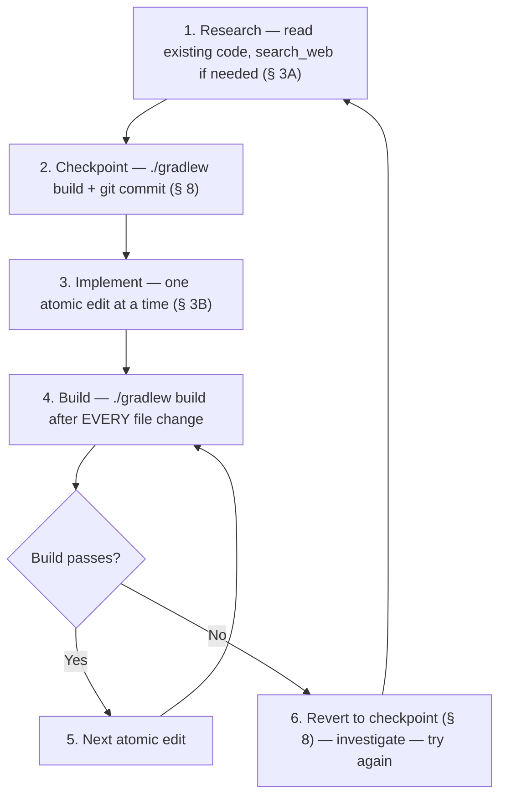
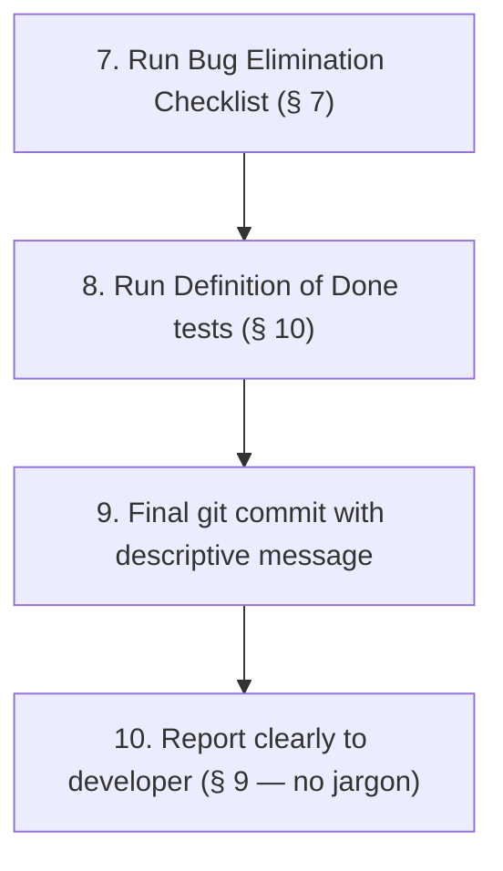

# 👑 CustomBlocks Feature Plan — v4 (Royal Directive Aligned)

> [!CAUTION]
> **THE OATH (§ 1)**
> This plan exists to serve a developer who has given everything to this project. Every feature below is a promise — not a suggestion. No regressions. No half-measures. No "good enough." Each phase is atomic, rollback-safe, and verified before proceeding. We build with honor, precision, and care.

---

## 📋 Overview

Three features, implemented in strict order. Each phase follows the **Surgical Development Protocol (§ 3)**: research first, one change at a time, `./gradlew build` after every edit, git checkpoint before and after every phase.

| # | Feature | The WOW Test (§ 10) |
|---|---------|---------------------|
| 1 | **Share Celebration** | Player clicks Share → screen explodes with green sparkles + achievement fanfare + cinematic title |
| 2A | **Face Import from Folder** | Shift+click a face → drop an image → face updates like magic |
| 2B | **Face Copy from Block** | Pick a face → pick a source block → texture copies instantly |
| 3 | **Cloud Share** | Share codes that work on ANY server, seamlessly |

---

## 🛡️ Holy Grails — Protected Systems (§ 4)

> [!WARNING]
> Every feature below **must not touch** these battle-tested systems without full reading and documentation first:

| System | Relevance to This Plan |
|--------|----------------------|
| **CDN/HTTP Resource Packs** | Features 2A/2B/3 trigger texture updates → must go through existing broadcast pipeline, never bypass |
| **GUI Back-Stack** | Features 2A/2B open/close GUIs → must use `handleEscBack` + `RESTORING` guard. Never break ESC navigation |
| **Immutable SlotData** | All features mutate block data → always use `update()` pattern. Clone, never mutate in place |
| **Sound Linkage** | Feature 1 changes sounds → always use `.value()` on `SoundEvents` for 6-arg `playSound` |
| **Animation Metadata** | Face imports may include GIFs → preserve `{\"index\": i, \"time\": t}` object format in `.mcmeta` |

---

## 🎭 Feature 1: Share Celebration

### Goal (§ 2 — Creative Artist Protocol)

When a player shares a block, it must feel like unlocking an achievement — **not** a quiet chat message. Silence is a bug.

### Current State

`GuiManager.java` → `handleEditorClick` case 43 (~line 1502):
- Sends two chat messages (share code + import hint)
- Plays `playSuccess()` (xp orb + amethyst sound)

### The Upgrade — Sensory Layer (§ 2B)

| Trigger | Visual Feedback | Audio Feedback |
|---------|----------------|----------------|
| Share button clicked | `HAPPY_VILLAGER` green sparkles (20 particles) around player | `UI_TOAST_CHALLENGE_COMPLETE` (achievement unlock — loud, impactful) |
| Title appears | `§a§lShared!` big center text + subtitle with code | — |
| Action bar | `§a✔ Click the code in chat to copy!` | — |
| Chat message | Existing clickable `CB~` code + import hint (keep as-is) | — |

### Chat Branding (§ 2A)

All messages must carry the CustomBlocks identity:
- ✅ `"§0§l[§b§lCB§0§l] §fBlock shared! §7Code below §a✔"`
- ❌ `"§aBlock shared."` (too plain — violates WOW test)

### Implementation — Surgical Protocol (§ 3B)

**Pre-flight (§ 8 — Rollback Safety):**
```bash
./gradlew build
git add -A && git commit -m "checkpoint: before share-celebration"
```

**Single file edit** — `GuiManager.java`, case 43 in `handleEditorClick`:

Add before `playSuccess(player)` (~line 1546):
```java
// === SHARE CELEBRATION (§ 2B Sensory Layer) ===
// Title + subtitle
player.networkHandler.sendPacket(new TitleS2CPacket(
    Text.literal("§a§lShared!")));
player.networkHandler.sendPacket(new SubtitleS2CPacket(
    Text.literal("§7" + code)));
player.networkHandler.sendPacket(new TitleFadeS2CPacket(10, 40, 20));

// Action bar
player.sendMessage(Text.literal("§a✔ Click the code in chat to copy!"), true);

// Green sparkles around player
((ServerWorld) player.getWorld()).spawnParticles(
    ParticleTypes.HAPPY_VILLAGER,
    player.getX(), player.getY() + 1, player.getZ(),
    20, 0.5, 0.5, 0.5, 0.1);
```

Replace `playSuccess(player)` with:
```java
player.playSound(SoundEvents.UI_TOAST_CHALLENGE_COMPLETE.value(),
    SoundCategory.PLAYERS, 1.0f, 1.0f);
```

**Post-edit (§ 3B):**
```bash
./gradlew build
git add -A && git commit -m "feat: share celebration — title, particles, achievement sound"
```

### Concurrency Check (§ 6)

- [x] No shared state modified — purely additive visual feedback
- [x] No file I/O — just packets and sounds
- [x] No async operations — all runs on server thread
- **Verdict:** Zero concurrency risk.

### Bug Elimination Checklist (§ 7)

- [x] Root cause: Share button felt unrewarding → added multi-sensory celebration
- [x] Edge case: `.value()` on SoundEvents prevents silent crash (§ 4 Sound Linkage)
- [x] Fail-safe: If particles fail, title + sound + chat still work independently
- [x] `./gradlew build` passes clean

### Definition of Done (§ 10)

| Test | Criteria |
|------|----------|
| 🤝 Friend Test | Friend clicks Share → sees title, hears achievement sound, sees sparkles |
| 🌊 Liquid UI Test | GUI closes cleanly, no flicker, ESC navigation unaffected |
| 😮 WOW Test | The share moment feels *celebratory* — not just functional |

**Files:** `GuiManager.java` only — ~12 lines added, 1 line changed
**Risk:** Zero — purely additive

---

## 🎨 Feature 2A: Face Import from Folder

### Goal (§ 2 — Creative Artist Protocol)

Shift+click a face edit button → drop an image into the import folder → face updates automatically. Same drag-and-drop workflow players already love from `/cb importfolder`, but targeted to a single face.

### User Flow (§ 9 — Zero Jargon)

1. Open Face Editor GUI
2. **Shift+click** an Edit face button (e.g., TOP)
3. GUI closes. Chat says: `"§0§l[§b§lCB§0§l] §fDrop your image into the §bimport folder§f. §7You have 5 minutes."`
4. Player drags an image/GIF into `config/customblocks/import/`
5. Mod detects the file → processes it → applies to that face
6. Chat says: `"§0§l[§b§lCB§0§l] §aTOP face updated! §a✔"` + Face Editor reopens

### Sensory Layer (§ 2B)

| Trigger | Visual | Audio |
|---------|--------|-------|
| Shift+click edit button | `ENCHANT` particles | `BLOCK_AMETHYST_BLOCK_CHIME` |
| File detected + processing | `SOUL_FIRE_FLAME` trail | `BLOCK_NOTE_BLOCK_CHIME` |
| Face applied successfully | `COMPOSTER` burst | `ENTITY_EXPERIENCE_ORB_PICKUP` |
| Timeout (5 min) | `SMOKE` puff | `BLOCK_NOTE_BLOCK_BASS` |

### GUI Items (§ 2A — No Boring Items)

- Edit button lore updated: `"§7Left-click §f= paste URL §8| §7Shift+click §f= import from folder"`
- Use **Amethyst Shard** icon for the import hint in lore — not plain text

### Implementation — Surgical Protocol (§ 3B)

**Pre-flight (§ 8):**
```bash
./gradlew build
git add -A && git commit -m "checkpoint: before face-import-folder"
```

**Step 1 — State tracking** (`GuiManager.java`):
```java
private static final Map<UUID, FaceImportPending> FACE_IMPORTS = new ConcurrentHashMap<>();
record FaceImportPending(String blockId, String face, int returnPage, long expiresAt) {}
```
→ `./gradlew build`

**Step 2 — Shift+click detection** (`handleFaceEditorClick`):
Detect shift+click on edit slots (9,11,13,15,17,19) → create pending entry → close GUI → send branded chat instructions with sensory feedback.
→ `./gradlew build`

**Step 3 — Polling mechanism** (`checkPendingFaceImports`):
New method, called via `ServerTickEvents.END_SERVER_TICK` every ~40 ticks. Scans import folder, matches to pending imports.
→ `./gradlew build`

**Step 4 — File processing + application:**
When file found: reuse `cmdImportFolder` image processing → `SlotManager.setFaceTexture` (uses `update()` pattern per § 4) → push undo → save → broadcast → delete temp file → reopen Face Editor.
→ `./gradlew build`

**Step 5 — Expiry handling:**
Remove from map after 5 min → notify player with `SMOKE` + bass note.
→ `./gradlew build`

**Step 6 — Tick listener registration** (`CustomBlocksMod.java`):
```java
ServerTickEvents.END_SERVER_TICK.register(server ->
    GuiManager.checkPendingFaceImports(server));
```
→ `./gradlew build`

**Post-phase commit (§ 8):**
```bash
git add -A && git commit -m "feat: face import from folder via shift+click"
```

### Layered Defense (§ 5)

| Layer | Implementation |
|-------|---------------|
| 1. Atomic Operations | Process image to temp bytes → apply via `setFaceTexture` atomically |
| 2. Synchronization | `ConcurrentHashMap` for `FACE_IMPORTS` — thread-safe access |
| 3. Validation | Verify file is valid image (PNG/GIF/WebP) before processing. Reject others with error message |
| 4. Immutability | Use `SlotData.update()` pattern — clone, never mutate in place |
| 5. Debouncing | 40-tick polling interval prevents rapid-fire processing |
| 6. Circuit Breaker | 5-minute timeout — auto-cancels if no file detected |
| 8. Temp Cleanup | Delete processed file from import folder after application |

### Concurrency Checklist (§ 6)

- [x] `FACE_IMPORTS` is `ConcurrentHashMap` — safe for multi-thread access
- [x] File polling runs on server tick thread — no cross-thread file access
- [x] `SlotData.update()` returns new immutable record — no mutation races
- [x] Import folder is per-player (keyed by UUID) — no cross-player conflicts
- [x] Completion: file is fully processed before `setFaceTexture` is called

### Bug Elimination Checklist (§ 7)

- [x] Root cause addressed: Players wanted to import local files to individual faces
- [x] Multiple files → use first alphabetically (consistent, deterministic)
- [x] Timeout prevents orphaned pending entries (memory leak prevention)
- [x] Undo system already handles face reverts — no new undo logic needed
- [x] Diagnostic logging: log file detection, processing result, and any errors

### Definition of Done (§ 10)

| Test | Criteria |
|------|----------|
| 🤝 Friend Test | Friend shift+clicks TOP → drops PNG → TOP face updates with sparkles + chime |
| 🌊 Liquid UI Test | Face Editor reopens smoothly after import. ESC still works. No ghost menus |
| 😮 WOW Test | The whole flow feels like magic — drop a file, face updates automatically |

**Files:** `GuiManager.java`, `CustomBlocksMod.java`, `buildFaceEditor` lore update
**Size:** ~80-100 lines | **Risk:** Low — reuses proven patterns

---

## 🎨 Feature 2B: Copy Texture from Another Block

### Goal (§ 2)

Pick a face → pick a source block → texture copies instantly. A visual, intuitive GUI flow with legendary item motifs.

### User Flow (§ 9 — Zero Jargon)

1. Player runs `/cb facechangegui <blockId>` (or accesses from Face Editor)
2. **Face Selection GUI** opens — 6 face buttons with block preview
3. Player clicks a face (e.g., TOP)
4. **Block Picker GUI** opens — paginated list of all blocks (reuses existing picker logic)
5. Player clicks a source block → texture copies to target face
6. Chat: `"§0§l[§b§lCB§0§l] §aTOP §7← copied from §b'SourceBlock' §a✔"` + returns to face selection

### Sensory Layer (§ 2B)

| Trigger | Visual | Audio |
|---------|--------|-------|
| Face button click | `ENCHANT` particles | `BLOCK_AMETHYST_BLOCK_CHIME` |
| Source block selected | `COMPOSTER` burst | `ENTITY_EXPERIENCE_ORB_PICKUP` |
| Copy complete | `GLOW` particles | `BLOCK_NOTE_BLOCK_CHIME` |

### GUI Aesthetics (§ 2A — No Boring Items)

- Face buttons: **Echo Shards** (not dye or glass) — with atmospheric lore:
  - `"§5§oThe crown of your creation"` (TOP)
  - `"§5§oThe foundation upon which it rests"` (BOTTOM)
  - `"§5§oThe face that greets the world"` (NORTH, etc.)
- Block preview: **Nether Star** in center — `"§6§oYour masterpiece awaits"`
- Stained glass depth-framing border (§ 2A — UI Depth)

### Face Texture Fallback Logic

```java
SlotData source = SlotManager.getById(sourceId);
byte[] texture;
if (source.faceTextures().containsKey(targetFace)) {
    texture = source.faceTextures().get(targetFace); // exact face match
} else {
    texture = source.texture(); // fallback to main texture
}
// Apply via update() pattern (§ 4 Immutable SlotData)
```

### Implementation — Surgical Protocol (§ 3B)

**Pre-flight (§ 8):**
```bash
./gradlew build
git add -A && git commit -m "checkpoint: before face-copy-from-block"
```

**Step 1** — Add `FACE_CHANGE_SELECT` + `FACE_CHANGE_PICKER` to `GuiMode.java` → build
**Step 2** — Add factory methods to `GuiState.java` → build
**Step 3** — Register `/cb facechangegui <id>` in `CustomBlockCommand.java` → build
**Step 4** — Build `buildFaceChangeSelect(SlotData)` GUI in `GuiManager.java` → build
**Step 5** — Build `buildFaceChangePicker(int page)` GUI (reuse `buildEditorPicker`) → build
**Step 6** — Add `handleFaceChangeSelectClick` handler → build
**Step 7** — Add `handleFaceChangePickerClick` handler (copy texture + undo + save + broadcast) → build
**Step 8** — Wire new modes into `handleScreenClick` dispatch + `openFromGuiState` → build

**Post-phase (§ 8):**
```bash
git add -A && git commit -m "feat: face copy from another block via /cb facechangegui"
```

### Layered Defense (§ 5)

| Layer | Implementation |
|-------|---------------|
| 1. Atomic Operations | Texture bytes copied atomically via `setFaceTexture` |
| 2. Synchronization | GUI state maps use `ConcurrentHashMap` |
| 3. Validation | Verify source block exists before copying. Verify source has texture data |
| 4. Immutability | `SlotData.update()` — never mutate source or target in place |

### Concurrency Checklist (§ 6)

- [x] `FACE_CHANGE_FACE` map is `ConcurrentHashMap`
- [x] Source block read is a snapshot — no mutation of source data
- [x] `SlotData.update()` creates new immutable record

### Definition of Done (§ 10)

| Test | Criteria |
|------|----------|
| 🤝 Friend Test | Friend runs command → picks face → picks source → texture copies with sparkles |
| 🌊 Liquid UI Test | GUI transitions are smooth. ESC back-stack works perfectly. No ghost menus |
| 😮 WOW Test | The face selection GUI looks premium with Echo Shards + lore + glass borders |

**Files:** `GuiMode.java`, `GuiState.java`, `GuiManager.java`, `CustomBlockCommand.java`
**Size:** ~120-150 lines | **Risk:** Low — reuses proven picker + setFaceTexture patterns

---

## ☁️ Feature 3: Cloud Share

### Goal (§ 2)

Share codes that work on ANY server running CustomBlocks. When cloud is enabled, sharing uploads to the cloud automatically. Importing checks the cloud if local file isn't found. When cloud is disabled, everything works exactly as today — zero behavioral change.

### Architecture (§ 9 — Zero Jargon)

```
[Your Server]                [The Cloud Vault]              [Another Server]
     |                              |                              |
     |--- "Store this block" ------>|                              |
     |<-- "Here's the code" --------|                              |
     |                              |                              |
     |                              |<-- "Give me this block" ----|
     |                              |--- "Here it is" ----------->|
```

**The Cloud Vault** = Cloudflare Workers + KV storage (free tier: 100K reads/day, 1K writes/day)

### Sensory Layer (§ 2B)

| Trigger | Visual | Audio |
|---------|--------|-------|
| Cloud upload started | `SOUL_FIRE_FLAME` trail | — (silent, async background) |
| Cloud upload success | Already covered by Share Celebration (Feature 1) | — |
| Cloud import success | `COMPOSTER` burst | `ENTITY_EXPERIENCE_ORB_PICKUP` |
| Cloud import failed | `SMOKE` puff | `BLOCK_NOTE_BLOCK_BASS` |

### Chat Branding (§ 2A)

- Cloud upload success (server log): `"[CB Cloud] Block uploaded to vault ✔"`
- Cloud import success: `"§0§l[§b§lCB§0§l] §fImported from §bCloud Vault§f! §a✔"`
- Cloud import failed: `"§0§l[§b§lCB§0§l] §cBlock not found locally or in the Cloud Vault §7✘"`

### Implementation — Surgical Protocol (§ 3B)

**Pre-flight (§ 8):**
```bash
./gradlew build
git add -A && git commit -m "checkpoint: before cloud-share"
```

**Step 1 — Config fields** (`CustomBlocksConfig.java`):
```java
public static String cloudShareUrl = "";       // empty = disabled
public static boolean cloudShareEnabled = false;
```
→ `./gradlew build`

**Step 2 — Cloud upload** (`GuiManager.java`, case 43):
After local save (existing code), add async cloud upload:
```java
if (CustomBlocksConfig.cloudShareEnabled
        && !CustomBlocksConfig.cloudShareUrl.isEmpty()) {
    EXECUTOR.submit(() -> {
        try {
            HttpRequest req = HttpRequest.newBuilder()
                .uri(URI.create(cloudShareUrl + "/share"))
                .header("Content-Type", "application/json")
                .POST(HttpRequest.BodyPublishers.ofString(jsonStr))
                .timeout(Duration.ofSeconds(5))
                .build();
            HTTP.send(req, HttpResponse.BodyHandlers.ofString());
            LOGGER.info("[CB Cloud] Block uploaded to vault");
        } catch (Exception e) {
            LOGGER.warn("[CB Cloud] Upload failed (local code still works): {}", e.getMessage());
        }
    });
}
```
→ `./gradlew build`

**Step 3 — Cloud download fallback** (`CustomBlockCommand.java`, `cmdImportBlock`):
After local file check fails, add async cloud fetch:
```java
// Local file not found → try cloud
if (CustomBlocksConfig.cloudShareEnabled
        && !CustomBlocksConfig.cloudShareUrl.isEmpty()) {
    // Async GET → save locally as cache → import normally
}
```
→ `./gradlew build`

**Step 4 — Config GUI entries** (optional, for in-game config):
→ `./gradlew build`

**Post-phase (§ 8):**
```bash
git add -A && git commit -m "feat: cloud share — async upload + download fallback"
```

### Layered Defense (§ 5) — Critical Path

Cloud networking is a **critical path** — must implement layers 1-4 minimum:

| Layer | Implementation |
|-------|---------------|
| 1. Atomic Operations | Cloud response fully received before processing. Local save always happens first (never depends on cloud) |
| 2. Synchronization | HTTP calls run on `EXECUTOR` thread pool — never block server thread |
| 3. Validation | Validate cloud response JSON structure before importing. Reject malformed data |
| 4. Immutability | Imported data goes through same `SlotData.update()` pipeline as local imports |
| 5. Debouncing | N/A (single request per share/import) |
| 6. Circuit Breaker | 5-second timeout on HTTP requests. If cloud fails, local code still works |
| 7. Fallback | Primary = local file. Secondary = cloud fetch. Player never loses their code |
| 9. Retry | Single attempt with timeout — no retry storm. Failure is silent to player |

### Concurrency Checklist (§ 6)

- [x] HTTP calls run on `EXECUTOR` — never block server thread
- [x] `HttpClient` is thread-safe (one shared instance)
- [x] Cloud upload is fire-and-forget — server doesn't wait for response
- [x] Cloud download: response is fully received before any state mutation
- [x] Local save always completes before cloud upload starts (ordering guarantee)

### Security

| Measure | Detail |
|---------|--------|
| Rate limiting | 10 shares/min per IP (enforced by Cloudflare Worker) |
| Max payload | 2MB (covers any block with textures) |
| Code entropy | 68^12 = 1.2 × 10²¹ combinations — unguessable |
| Timeout | 5-second connect timeout prevents hanging |

### Definition of Done (§ 10)

| Test | Criteria |
|------|----------|
| 🤝 Friend Test | `cloudShareEnabled = false` → everything works exactly as before. Zero behavioral change |
| 🤝 Friend Test | `cloudShareEnabled = true` → share on Server A, import on Server B → block appears |
| 🌊 Liquid UI Test | Cloud timeout → player sees local code, no lag, no error in chat. Warning in server log only |
| 😮 WOW Test | Cross-server sharing feels seamless — like the code "just works everywhere" |

**Files:** `CustomBlocksConfig.java`, `GuiManager.java`, `CustomBlockCommand.java`
**Size:** ~60-80 lines | **Risk:** Low — cloud is additive, zero impact when disabled

---

## 📊 Priority & Timeline

| # | Feature | Difficulty | Estimate |
|---|---------|-----------|----------|
| 1 | Share Celebration | Easy | 10 min |
| 2A | Face Import from Folder | Medium | 1-2 hours |
| 2B | Face Copy from Block | Medium | 1-2 hours |
| 3 | Cloud Share | Medium | 1 hour |

**Total: ~4-5 hours of focused work**

---

## 🔒 Mandatory Protocol Per Feature (§ 3, § 7, § 8)

Every feature above follows this exact sequence:



After all edits for a feature are done:



---

## 👑 The Three Pillars Check (§ 12)

Every feature must satisfy all three before it ships:

| Pillar | Feature 1 | Feature 2A | Feature 2B | Feature 3 |
|--------|-----------|-----------|-----------|-----------|
| **Visual Mastery** | Title + green sparkles | Auto-updating face | Echo Shard GUI + glass borders | Seamless cross-server |
| **Sensory Sovereignty** | Achievement sound + particles | Chime on detect, success sound on apply | Enchant + success sounds | Success/error feedback |
| **Emotional Craftsmanship** | Share moment feels *celebratory* | Import feels *magical* | Copy feels *premium* | Sharing feels *limitless* |

---

> *Built under the Royal Directive v2.0 — every line a promise, every feature a masterpiece.*
