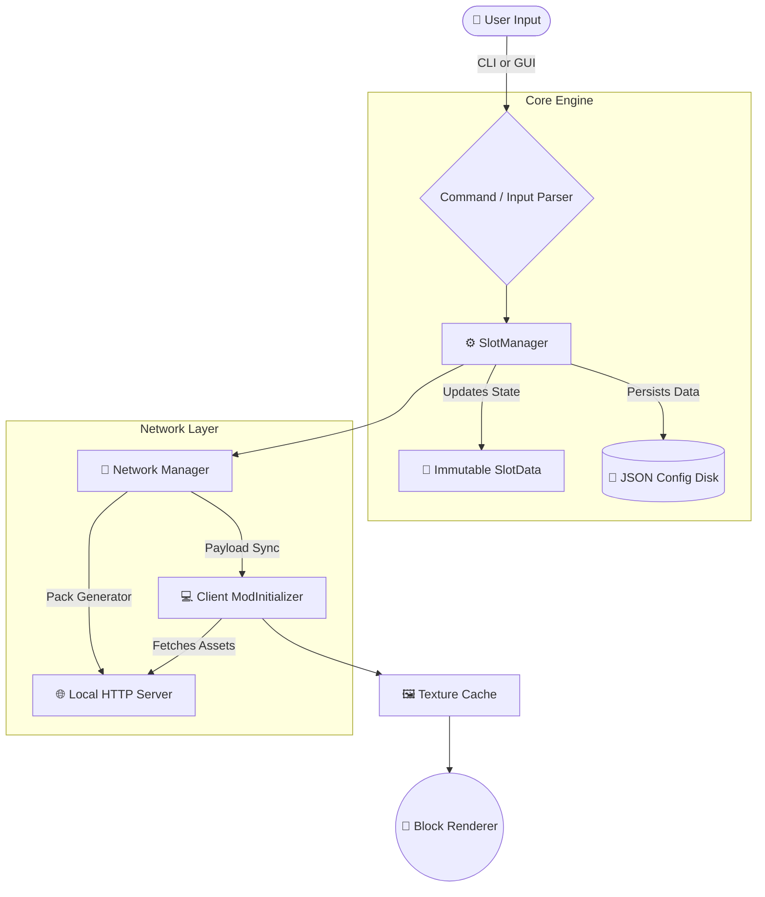

# 🏗️ Architecture Overview

The CustomBlocks mod is structured into a highly modular system separated by clear domains: **Core**, **GUI**, **Network**, **Items**, and **Client**. This ensures that the codebase remains scalable, even with over 25,000 lines of code.

---

## 🧭 High-Level Data Flow

The following sequence illustrates how an input travels from the user through the mod's subsystems down to the renderer.

---

## 🗂️ Package Deep Dive

Here is a breakdown of every major package and its responsibilities.

### 1. `com.customblocks`
The primary entrypoint of the mod.
- **`CustomBlocksMod.java`**: The `ModInitializer`. Registers blocks, items, commands, and payload receivers on the server.
- **`BlockFinder.java`**: Utility to quickly and optimally search for registered blocks.

### 2. `com.customblocks.client`
Handles all client-side logic (rendering, local GUIs, cache).
- **`CustomBlocksClient.java`**: The `ClientModInitializer`. Registers client screens, payload receivers, and texture rendering mechanisms.
- **`ResourcePackGenerator.java`**: Interacts with the `ResourcePackServer` to dynamically fetch and inject textures on the client side seamlessly.

### 3. `com.customblocks.core`
The **heart** of the CustomBlocks system. It manages block data, saving, loading, and states. 
> 👉 See **[Core Engine](core.md)** for a deep dive into Slot immutability.

### 4. `com.customblocks.gui`
The node-based visual editor interface. This is the largest and most complex package in the mod, powering a custom UI engine inside Minecraft.
> 👉 See **[GUI System](gui.md)** for a deep dive into the menu system.

### 5. `com.customblocks.network`
The sophisticated payload transmission layer. Minecraft's standard packet size limits are insufficient for sending large image data. This package contains chunking protocols and an embedded HTTP server to bypass these limits.
> 👉 See **[Network & Sync](network.md)** for a deep dive.

### 6. `com.customblocks.command`
Command logic layer.
- **`CustomBlockCommand.java`**: A massive >6,300 line class that handles every possible `/cb` and `/customblock` sub-command, parsing, and execution feedback.

### 7. `com.customblocks.item`
Custom utility tools used to manipulate the blocks.
- **Tools**: `DeleterItem`, `AmethystChiselItem`, `LuminaBrushItem`.
- **Shapes**: `ColorSquareItem`, `ColorTriangleItem`, `GoldenHexagonItem`. These items are dynamically recolorable based on precise user settings and block interaction states.

---

## 🔒 The Golden Rule: Immutability
One critical rule in CustomBlocks architecture: **SlotData is Immutable**. The mod leverages an `.update()` pattern to generate new block states, rather than mutating state in place. This guarantees that save files are never corrupted during sudden server crashes or client disconnects.
