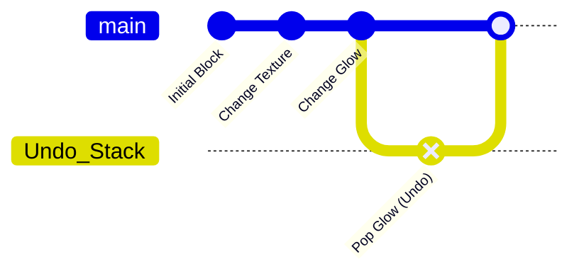

# ⚙️ Core Engine

The **Core Engine** (`com.customblocks.core`) handles the brain logic behind CustomBlocks. It manages all the invisible magic: storing block states, handling undo/redo histories, processing image URLs, and ensuring data remains persistent across server restarts.

---

## 💾 SlotManager (`SlotManager.java`)

Minecraft natively requires registering blocks with unique IDs at startup. CustomBlocks bypasses this by pre-registering 1028 generic "Slots" (`SlotBlock.java`) and dynamically binding metadata to them.

`SlotManager.java` is responsible for:
1. **Binding & Caching**: Linking `customblocks:slot_x` to a specific texture and property set.
2. **Atomic Saving**: Writing data to `customblocks_data.json` atomically. This prevents half-written JSON files from corrupting worlds if the server crashes mid-save.
3. **Player Interactivity**: Validating whether a player has permission to edit or interact with a specific slot.

---

## 🧱 SlotData Immutability (`SlotData.java`)

Every block is represented by a `SlotData` record in memory.

> **IMPORTANT:** `SlotData` is strictly immutable. 

You **cannot** mutate a block's texture directly in memory. Modifying values in place breaks the history tree and corrupts saves. Instead, use the builder updater pattern:

```java
// ❌ WRONG: Do not mutate
slot.texture = "https://new-image.png"; 

// ✅ CORRECT: Use the Updater pattern
SlotData updatedSlot = slot.update()
    .texture("https://new-image.png")
    .glowLevel(15)
    .build();
    
SlotManager.setSlot(id, updatedSlot);
```

This pattern allows the Undo/Redo system to confidently snapshot references without copying massive objects every tick.

---

## ↩️ UndoManager (`UndoManager.java`)

Whenever `SlotManager` applies an `.update()` to a `SlotData`, the `UndoManager` intercepts the previous state and pushes it onto a history stack for that specific player.



- **Redo Stack**: If an undo is triggered, the current state goes to the Redo stack.
- **Limits**: History is capped per-player to prevent memory leaks over long sessions.

---

## 🔍 Filters and Image Processing

The core also handles high-performance data processing:
- **`SearchFilter.java` & `SearchIndex.java`**: Custom fast-lookup indexing systems so the GUI can search hundreds of custom blocks instantly without lag spikes.
- **`ColorDetection.java`**: Analyzes the average color of a URL image to apply accurate tinting dynamically if needed.
