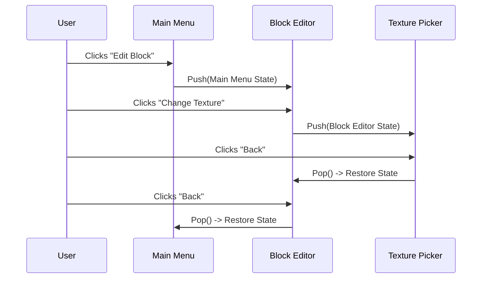

# 🖥️ GUI System

The graphical user interface in CustomBlocks is not a standard Minecraft UI. It is a completely custom, node-based rendering engine spanning over **9,400+ lines of code**. It handles dynamic rendering without creating a unique Java Screen class for every menu.

---

## 🎨 The GUI Manager (`GuiManager.java`)

`GuiManager.java` is the visual powerhouse of the mod. Instead of using generic UI builders, CustomBlocks implements an immediate-mode style GUI.

### Key Components

- **Node Rendering Engine**: Draws buttons, text inputs, sliders, and color pickers dynamically based on state.
- **`GuiMode.java` Contexts**: An enum dictating the current visual context.
  - `MAIN_MENU`: Overview of features.
  - `BLOCK_EDITOR`: Deep editing of a specific block.
  - `TEXTURE_PICKER`: Selecting URLs.
  - `SHAPE_EDITOR`: Modifying bounding boxes.
- **Color Library (`ColorLibrary.java`) & Picker (`ColorPickerHelper.java`)**: Custom color selection matrices for dynamic block and item recoloring, supporting HSV/RGB blending.

---

## 🔙 The ArrayDeque Back-Stack

Navigating deep into menus (like editing a block's specific face texture) and pressing "Back" is seamless. The stack saves the exact `GuiState` and `GuiMode`.



> **WARNING — The Mistake Ledger**
> Editing `GuiManager.java` is extremely high risk. The `ArrayDeque` + `RESTORING` guard pattern is fragile. A single incorrect edit to state pushing/popping can break the "Back" button across the entire mod or cause infinite menu loops. Always test UI changes deeply.

---

## 🕹️ Input Handling & Actions

User inputs are intercepted and resolved through a custom action queue (`InputAction`). This prevents race conditions where a user clicks "Save" and "Back" in the exact same tick.

```java
// Example pseudo-flow for an input action:
public enum InputAction {
    SAVE, 
    DISCARD, 
    DUPLICATE, 
    NEXT_PAGE, 
    PREV_PAGE
}
```

---

## ✨ Dedicated Screens

While `GuiManager` handles the heavy lifting, dedicated screen classes bind the manager to Minecraft's rendering lifecycle:
- **`HudEditorScreen.java`**: Overlays visual guidelines on the player's HUD.
- **`AnimBlockScreen.java`**: The editor screen for GIF and animated textures, which runs entirely independently of static textures.
- **`DevConsoleScreen.java`**: In-game administrative logs and raw payload viewer.
