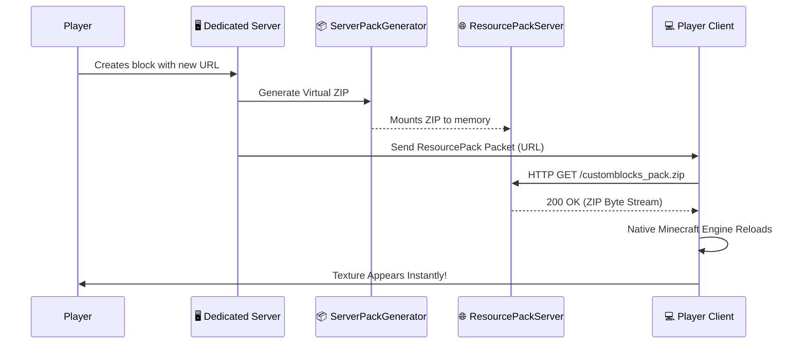

# 📡 Network & Sync

Minecraft's native networking system (`CustomPayload`) has strict packet size limits. CustomBlocks requires sending complex metadata, massive block configurations, and dynamic assets between the server and the client without breaking the connection. 

The `com.customblocks.network` package handles this using a split architecture: **Standard Payloads** and the **HTTP ResourcePackServer**.

---

## 📨 Standard Payloads

The `NetworkManager.java` coordinates a fleet of specialized payload classes:

- **`FullSyncPayload`**: Triggered when a client joins. It sends a compressed delta of all 1028 custom blocks.
- **`SlotUpdatePayload`**: When a player updates a single block in the GUI, this payload blasts the updated JSON representation to all tracking clients instantly.
- **`ConfigSyncPayload` & `HudConfigSyncPayload`**: Synchronizes server-side configuration limits (e.g., whether players can use animated blocks) to the client UI, preventing clients from clicking disabled buttons.
- **`ChunkedTexturePayload`**: A fallback protocol for streaming raw image byte arrays in chunks when HTTP delivery is unavailable.

---

## 🌐 The HTTP ResourcePackServer

Generating custom textures dynamically and pushing them into Minecraft's rendering engine on the fly is extremely difficult. The solution is a local HTTP Server.

> **CAUTION — The Mistake Ledger**
> The `ResourcePackServer.java` is the most delicate file in the networking package. Do not modify its async threading model lightly. Errors here result in "purple and black" missing textures for all players.

### 🔄 The Resource Injection Sequence

### How It Works:
1. When a custom block is created, `ServerPackGenerator.java` dynamically generates a virtual ZIP Resource Pack in memory containing the new JSON models and texture configurations.
2. `ResourcePackServer.java` spins up a micro HTTP server locally on the dedicated server host.
3. It sends a standard Minecraft Server Resource Pack packet to the client, pointing to `http://<server-ip>:<port>/customblocks_pack.zip`.
4. The client's native Resource Pack engine downloads it, applies the textures seamlessly, and re-renders the chunks.

This ingenious workaround bypasses all standard packet limits and ensures that textures map correctly to the blocks without manual client modpack updates.
